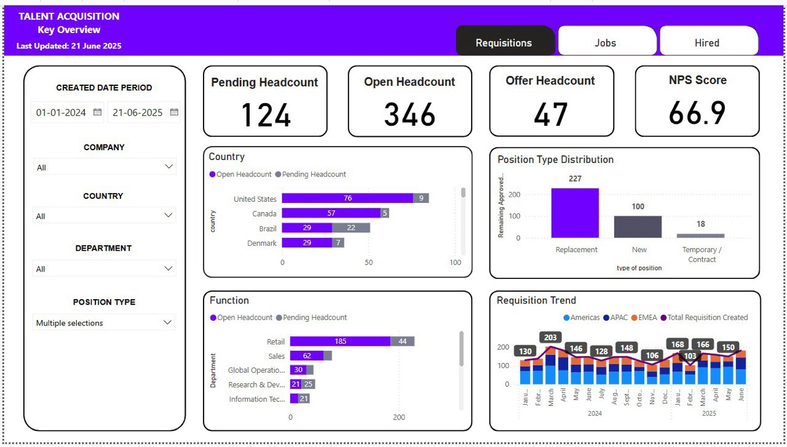
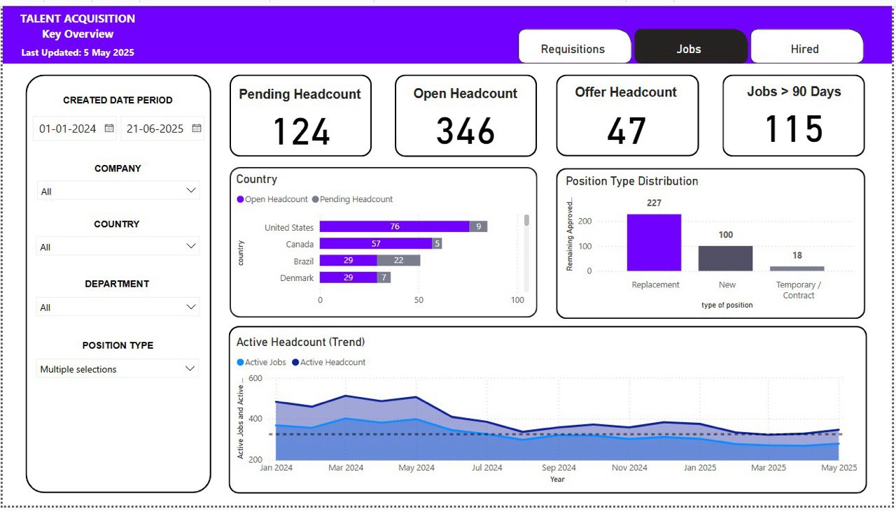
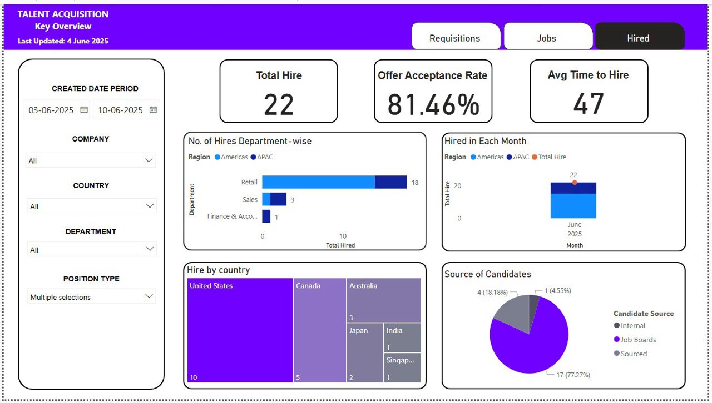
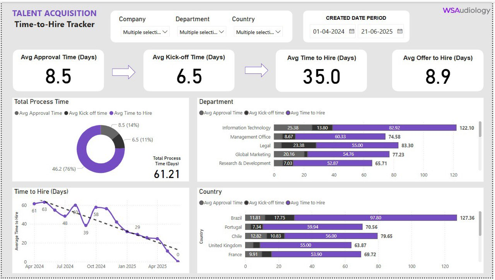
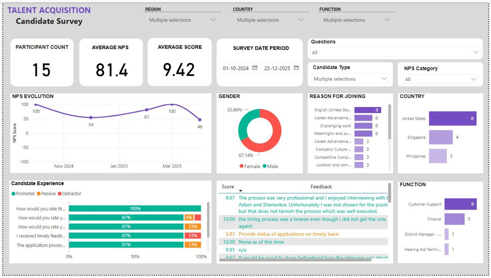

# WSAudiology

## Company Overview

WSAudiology (WSA) is a global leader in the hearing aid industry, dedicated to improving the quality of life for millions of people with hearing needs worldwide. Formed in 2019 through the merger of Sivantos Group and Widex, the company brings together over 170 years of combined experience and a rich history of pioneering innovation in hearing care.

## Problem Statement
WSAudiology (WSA) currently utilizes Teamtailor as its Applicant Tracking System (ATS) to manage all recruitment activities. However, the data within Teamtailor lacks sufficient accessibility for direct extraction and analysis by business stakeholders.

This prevents key stakeholders from gaining critical, timely insights into recruitment efficiency, talent pipeline health, and workforce planning, leading to up to 100 hours annually spent on manual data extraction and hindering data-driven talent acquisition decisions.

To address this, the present project aims to establish a robust data pipeline that can efficiently extract and load recruitment data from Teamtailor. This pipeline will transform the raw data into usable, actionable insights, empowering business stakeholders with the necessary information to enhance recruitment effectiveness, strategically build talent pipelines, and proactively support long-term workforce planning.

## Table of Contents
- [WSAudiology](#wsaudiology)
  - [Company Overview](#company-overview)
  - [Problem Statement](#problem-statement)
  - [Table of Contents](#table-of-contents)
  - [Tech Stack](#tech-stack)
  - [Project Architecture](#project-architecture)
  - [Insights \& Visualization](#insights--visualization)
    - [Executive Reporting](#executive-reporting)
    - [Recruitment Efficency](#recruitment-efficency)
    - [Candidate Experience](#candidate-experience)

## Tech Stack

 
 
 
 
 
 
 

---
- **Containerization Platform:** Docker  
  
    Docker provides standardized, consistent environments, simplifying deployment and ensuring consistency between development and production.

- **Cloud Platform:** Google Cloud Platform (GCP)  
   
    GCP offers reliable and scalable infrastructure and services, ideal for data-intensive cloud-native solutions.

- **Infrastructure as Code:** Terraform  
  
    Terraform manages GCP resources programmatically, ensuring repeatable, version-controlled, and consistent infrastructure deployment.

- **Workflow Orchestration:** Dagster 
  
    Dagster orchestrates data pipelines as "software-defined assets," providing clear lineage, observability, and robust data governance for reliable workflows.

- **Data Transformation:** dbt-core
  
    dbt-core enables powerful data transformation and modeling in SQL, ensuring data quality and consistency with modular design and testing.

- **Storage & Warehousing:** Google Cloud Storage (GCS), BigQuery  
  
    GCS provides high-performance data lake storage, while BigQuery offers serverless, cost-effective, petabyte-scale data warehousing with automatic scaling.

- **Visualization:** PowerBI  
  
    PowerBI provides rich data visualization capabilities, directly connecting to BigQuery data sources to create interactive dashboards. 

## Project Architecture

## Insights & Visualization

### Executive Reporting

### Recruitment Efficency

### Candidate Experience

