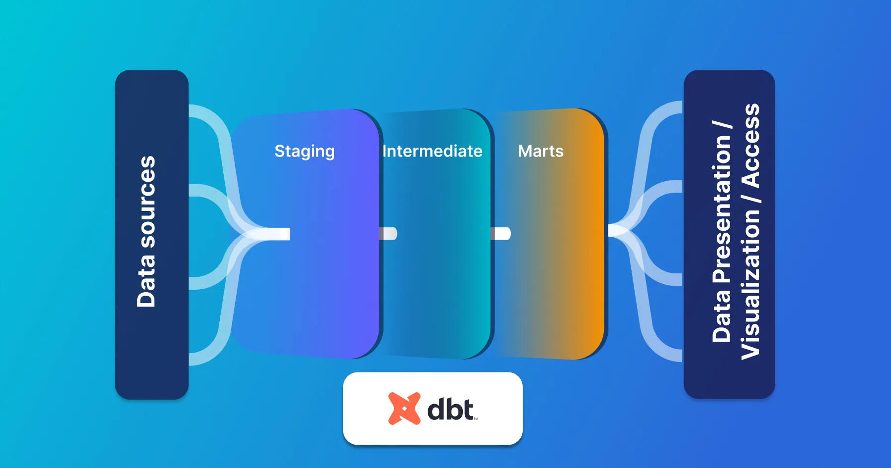

## General Structure

### Staging
* 1-to-1 relationship (or mapping) to source tables.
* simple and minimise transformations
  * type casting
  * column renaming
  * categorisation (e.g. using CASE WHEN statements)
* materialise them as *views*

### Intermediate
* Be materialised ephemerally (or as views in a custom schema)
* Not be exposed to end users (through apps or dashboards)
* Be created to isolate complex operations
* Not be referenced repeatedly in more than one model 
  * (if this is the case consider turning the intermediate model into a macro)

### marts 
* Be materialised as tables or incremental models
* Avoid too many joins in a single mart model

